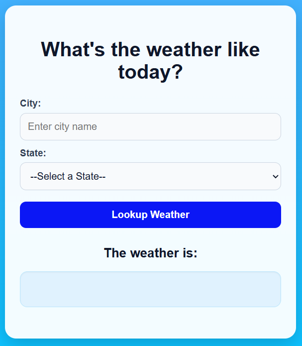
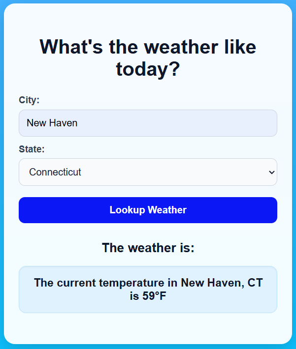

# Weather App

A simple weather app built with **HTML**, **CSS**, and **Vanilla JavaScript** that lets users enter a city, choose a state from a dropdown, and look up the current temperature using the **Open-Meteo API**.

## Features

- Enter a city name
- Select a state from a dropdown
- Click a button to look up the weather
- Display the current temperature
- Built with HTML, CSS, and vanilla JavaScript
- Uses the free Open-Meteo API
- Responsive user interface

## Tech Stack

- **HTML5**
- **CSS3**
- **Vanilla JavaScript**
- **Open-Meteo API**

## How It Works

1. The user types in a city name
2. The user selects a state from the dropdown
3. The user clicks the **Look Up Weather** button
4. JavaScript sends a request to the weather API
5. The app retrieves and displays the current temperature

## Project Structure

```bash
weather-app/
│── index.html
│── style.css
│── script.js
```

## Getting Started

### 1. Clone the repository

```bash
git clone https://github.com/Shehu-Muhammad/Quick-Projects.git
```

### 2. Open the project folder

```bash
cd weatherApp
```

### 3. Run the app

Open `index.html` in your browser.

## API Setup

This project uses the **Open-Meteo API**, a free and open source weather API.

- No API key required
- Free to use
- Simple to integrate with JavaScript

The app sends a request after the user enters a city, selects a state, and clicks the weather lookup button. It currently retrieves and displays the **current temperature** for the selected location.

Example request structure:

```js
const url = `https://api.open-meteo.com/v1/forecast?latitude=LATITUDE&longitude=LONGITUDE&current=temperature_2m`;
```

At the moment, the app only shows temperature, but Open-Meteo also supports additional weather data such as wind speed, humidity, hourly forecasts, and daily forecasts for future updates.

## Future Improvements

- Show weather conditions
- Add humidity and wind speed
- Add hourly or daily forecast
- Improve error handling
- Add weather icons
- Add geolocation support
- Add dark mode

## Lessons Learned

This project helped strengthen skills in:

- DOM manipulation
- Handling form input
- Working with dropdown selections
- Fetching data from APIs
- Using asynchronous JavaScript
- Building responsive layouts with CSS

## Live Demo

[Live Demo](https://quick-projects-murex.vercel.app/)

## Screenshots



### EXAMPLE



## Author

**Shehu Muhammad**

- GitHub: [Shehu-Muhammad](https://github.com/Shehu-Muhammad)

## License

This project is open source and available under the [MIT License](LICENSE).
